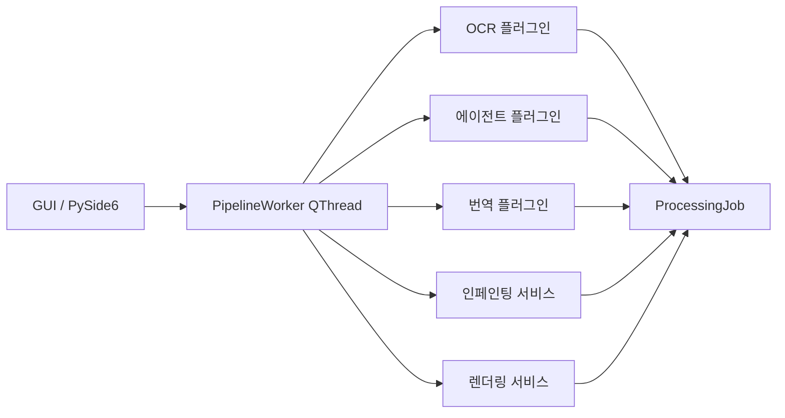

# trans_image — AI 기반 이미지 텍스트 자동 번역 프로그램

## 프로젝트 개요

이미지 속 텍스트를 자동으로 탐지·번역하고 원문 위치에 삽입하는 데스크탑 애플리케이션.

- **언어**: Python 3.11+
- **GUI**: PySide6 (Qt6)
- **아키텍처**: 플러그인 기반 — 번역 모델과 AI 에이전트 모두 교체 가능

---

## 📂 상세 문서 참조 (Lazy Loading)

> 아래 파일들은 필요할 때만 읽으세요. CLAUDE.md에 직접 넣지 않습니다.

- 플러그인 개발 가이드: `@docs/plugin-dev-guide.md`
- 지원 플러그인 전체 목록: `@docs/plugins.md`
- 핵심 데이터 구조 상세: `@docs/data-models.md`
- 파이프라인 흐름 상세: `@docs/pipeline.md`
- 코딩 컨벤션: `@docs/conventions.md`
- 환경 설정 & 실행: `@docs/setup.md`
- 변경 이력: `@docs/changelog.md`

---

## Git 규칙

- `.env` 등 시크릿 파일 commit / push 금지
- `.env` 등 시크릿 파일 직접 접근 금지

---

## 핵심 아키텍처 원칙

1. **플러그인 분리**: OCR / 번역 / 에이전트 각각 별도 ABC (추상 기반 클래스)
2. **에이전트 ≠ 번역기**: 에이전트는 OCR 결과 분석·컨텍스트 생성·검증만 담당.
   번역 API 직접 호출 금지 — 파이프라인을 통해 번역 플러그인에 위임.
3. **비동기 우선**: 모든 플러그인 메서드는 `async`. QThread 내부에서 asyncio 루프 실행.
4. **GUI 응답성**: 처리 중 UI 블로킹 금지. `PipelineWorker(QThread)` + Signal 패턴 사용.

---

## 🏗️ 아키텍처 개요



> 상세 파이프라인 흐름: `@docs/pipeline.md`

---

## 디렉토리 구조

```
trans_image/
├── main.py
├── pyproject.toml
├── TODO.md                     # 작업 연속성 관리
├── docs/                       # 상세 문서 (Lazy Loading 대상)
├── config/
│   ├── default_config.yaml
│   └── plugins.yaml
├── src/
│   ├── core/
│   ├── models/
│   ├── plugins/
│   │   ├── base/
│   │   ├── ocr/
│   │   ├── translators/
│   │   └── agents/
│   ├── services/
│   ├── gui/
│   │   ├── widgets/
│   │   ├── dialogs/
│   │   └── workers/
│   └── utils/
├── assets/
│   ├── fonts/
│   └── styles/main.qss
└── tests/
    ├── unit/
    └── integration/
```

---

## ⚙️ 워크플로우 원칙

### 세션 관리

- **한 세션 = 한 피처** — 여러 기능을 한 세션에서 연달아 구현하지 않는다
- 세션 시작 시 `TODO.md`를 읽고 첫 번째 미완료 항목부터 시작한다
- 세션 종료 시 `TODO.md`를 업데이트하고 `docs/changelog.md`에 변경 이력을 기록한다
- `/context`로 토큰 사용량을 주기적으로 확인한다 (60% 이상이면 `/compact` 실행)

### 코딩 루프

- 큰 작업은 반드시 **Plan Mode** (`Shift+Tab`) 로 설계 후 실행한다
- **작은 변경 → 테스트 → 린트 → 커밋** 루프를 유지한다
- Thinking 로그에서 잘못된 가정이 보이면 즉시 **Escape**로 중단한다
- 에러 로그는 해석 없이 그대로 붙여넣는다

### 무거운 작업 오프로드

- 대용량 이미지 배치 처리, 로그 분석 등은 스크립트를 작성해 결과 요약만 보고한다

| 상황        | 프롬프트 예시                                                                  |
| --------- | ------------------------------------------------------------------------ |
| OCR 배치 검증 | "테스트 이미지 100장 OCR 정확도 측정 스크립트 작성해줘. 결과는 `output/ocr-report.json`으로"      |
| 번역 품질 비교  | "deepl vs gemini 번역 결과 diff 스크립트 만들어줘. `output/translation-diff.md`로 정리" |
| 인페인팅 성능   | "NS vs LaMa 처리 시간 벤치마크 스크립트 작성해줘. `output/bench.json`으로"                 |

---

## 🛠️ 자주 쓰는 스크립트

```bash
scripts/test.sh          # 단위 테스트
scripts/test-integ.sh    # 통합 테스트 (API 키 필요)
scripts/lint.sh          # 린트 + 타입 체크
scripts/coverage.sh      # 커버리지 측정
```

> 각 스크립트는 단일 책임 원칙 준수. `deploy-all.sh` 같은 거대 스크립트 금지.

---

## 주요 기술 주의사항

- **asyncio + Qt**: QThread 내부에서 `asyncio.new_event_loop()` 생성. 메인 스레드에서 `asyncio.run()` 호출 금지
- **EasyOCR 초기화**: 첫 실행 시 모델 다운로드 (수백 MB). 백그라운드 스레드에서 프리로드
- **인페인팅 마스크**: bbox를 `cv2.dilate()`로 팽창시켜 텍스트 스트로크 완전 제거
- **CJK 폰트**: 번들된 `assets/fonts/NotoSansCJK-*.ttf` 사용. 시스템 폰트 없을 때 폴백
- **언어 감지**: 전체 페이지 텍스트 연결 후 감지. 짧은 영역 단독 감지 신뢰도 낮음

---

## 변경 이력 기록 형식

작업 완료 후 `docs/changelog.md`에 아래 형식으로 기록:

```markdown
## YYYY-MM-DD: [변경 요약]
- 변경 내용
- 이유
- 참고 파일
```

---

## 출력 효율성 원칙

응답 토큰을 줄이기 위한 행동 규칙. 기존 내용과 충돌하지 않으며 항상 적용한다.

### 금지 행동

- **인사·감탄 금지**: "물론이죠!", "좋은 질문이에요!" 등 시작 문구 사용 금지
- **빈 마무리 금지**: "도움이 됐으면 좋겠습니다", "더 궁금한 점이 있으면..." 등 닫는 문구 금지
- **질문 반복 금지**: 사용자 요청을 그대로 반복해서 재진술 금지
- **불필요한 면책 금지**: 요청하지 않은 경고·주의사항·법적 고지 금지
- **요청 외 제안 금지**: 지시받지 않은 추가 기능·개선 사항 제안 금지
- **과설계 금지**: 단순 요청에 불필요한 추상화·확장성 고려 금지
- **불확실 단정 금지**: 모르는 사실을 확실한 것처럼 서술 금지 — 모르면 모른다고 명시

### 권장 행동

- 답변은 요청된 범위만 다룬다
- 핵심부터 시작한다 (이유·배경은 필요할 때만)
- 코드는 요청된 것만 작성한다
